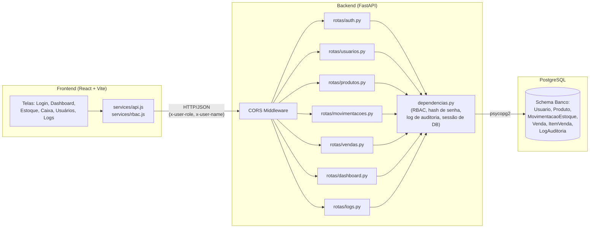
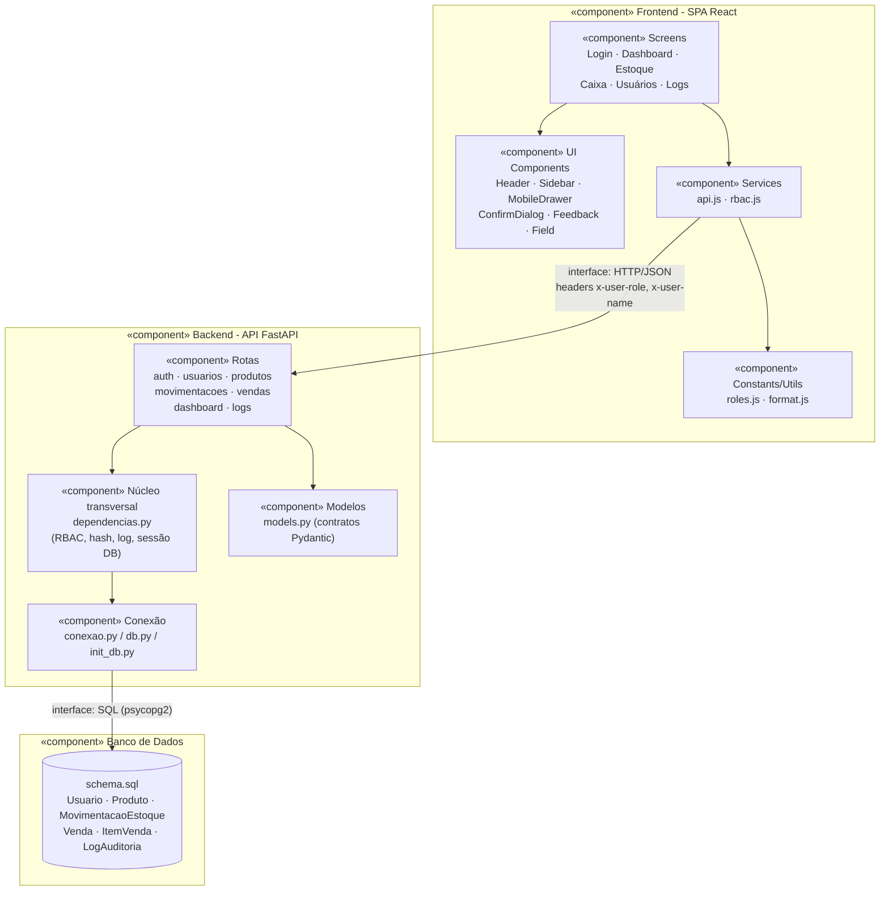
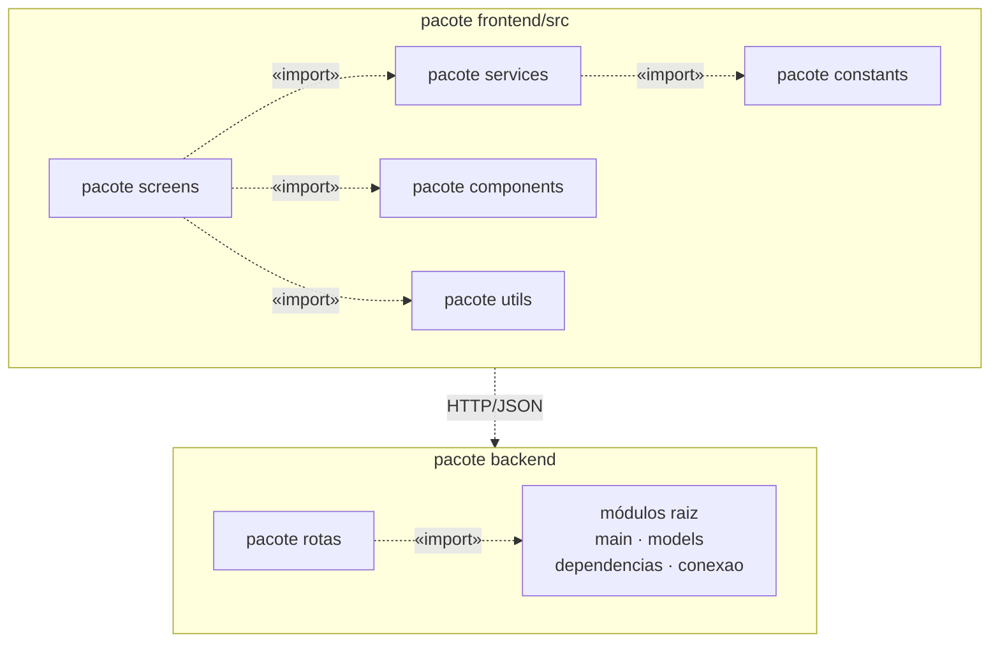
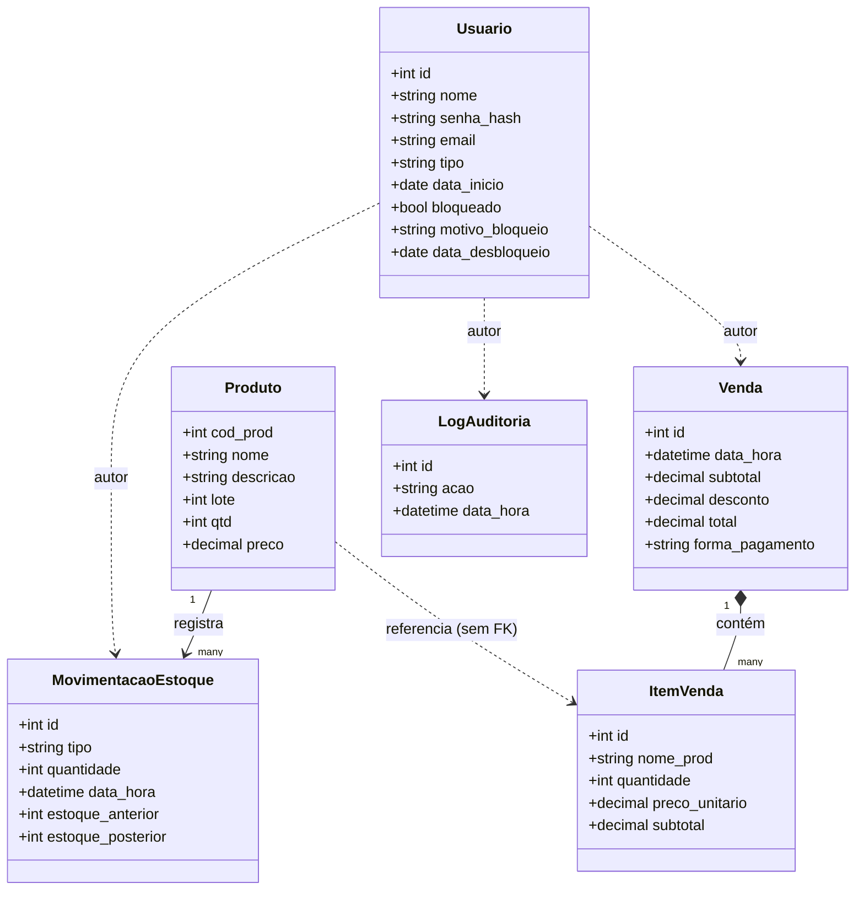
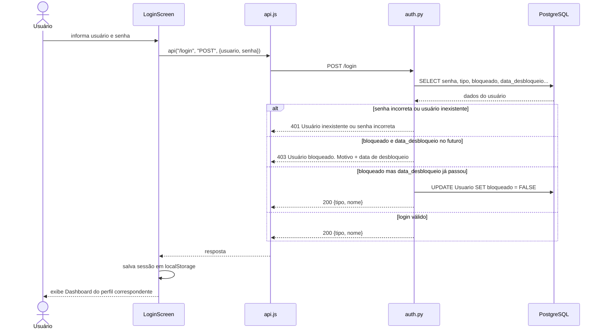
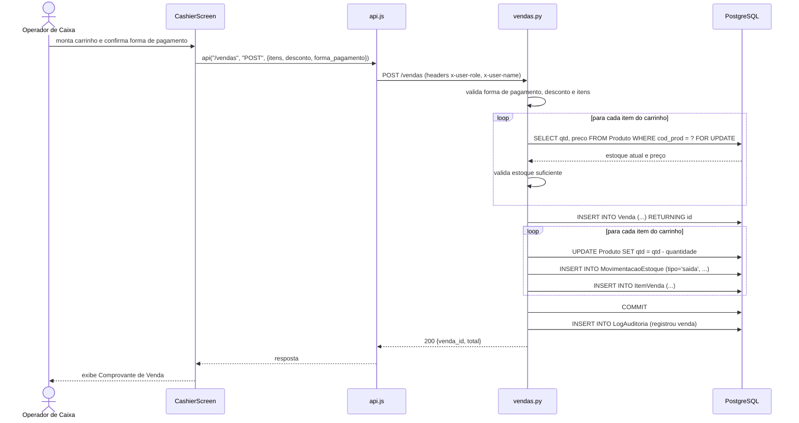
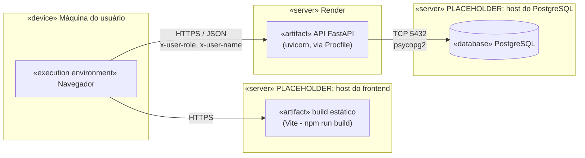

# Análise e Projeto do Software

## Projeto Arquitetural

O sistema segue uma arquitetura **cliente-servidor em três camadas**:

1. **Frontend (cliente):** Single Page Application em React 19, com Vite como bundler e Tailwind CSS para estilização. Consome a API via HTTP/JSON.
2. **Backend (servidor de aplicação):** API REST em Python com FastAPI, organizada em roteadores por domínio. Responsável pelas regras de negócio, validação e controle de acesso (RBAC).
3. **Banco de dados:** PostgreSQL, acessado via `psycopg2`, com o schema definido em [schema.sql](backend/schema.sql).

A autenticação/autorização é feita de forma simplificada: no login (`POST /login`), o backend valida usuário/senha (hash bcrypt) e retorna o nome e o perfil (`tipo`) do usuário. O frontend guarda essa sessão em `localStorage` e, a partir daí, envia o perfil e o nome do usuário em cada requisição via headers HTTP customizados (`x-user-role`, `x-user-name`; ver [api.js](frontend/src/services/api.js)). O backend usa esses headers para autorizar cada endpoint (`requer_role` em [dependencias.py](backend/dependencias.py)) e para registrar o autor de cada ação no log de auditoria.

<!-- PLACEHOLDER: se o grupo considerar esse mecanismo um risco de segurança (headers não são assinados/criptografados, podendo ser forjados pelo cliente), documente aqui como um ponto de melhoria futura (ex.: migrar para JWT). -->

## Projeto de Componentes

### Backend: módulos

| Módulo | Responsabilidade |
|---|---|
| [main.py](backend/main.py) | Ponto de entrada da aplicação FastAPI; registra middlewares (CORS) e roteadores; expõe `/health`. |
| [conexao.py](backend/conexao.py) / [db.py](backend/db.py) / [init_db.py](backend/init_db.py) | Conexão com o PostgreSQL e inicialização do schema. |
| [models.py](backend/models.py) | Modelos Pydantic de entrada/saída (contratos da API): `DadosLogin`, `DadosCadastro`, `DadosProduto`, `DadosAtualizarProduto`, `DadosAtualizarRole`, `DadosMovimentacao`, `DadosBloqueio`, `DadosItemVenda`, `DadosVenda`. |
| [dependencias.py](backend/dependencias.py) | Funções transversais: hash/verificação de senha (bcrypt), obtenção de conexão de banco por requisição, checagem de perfil (`requer_role`), identificação do usuário autor (`get_user_name`) e registro de log de auditoria (`registrar_log`). |
| [rotas/auth.py](backend/rotas/auth.py) | Login, autocadastro (`/registrar`) e cadastro por admin (`/cadastrar`). |
| [rotas/usuarios.py](backend/rotas/usuarios.py) | Listagem de usuários, alteração de perfil, bloqueio e desbloqueio. |
| [rotas/produtos.py](backend/rotas/produtos.py) | CRUD de produtos e busca. |
| [rotas/movimentacoes.py](backend/rotas/movimentacoes.py) | Registro e histórico (com filtros/paginação) de entradas e saídas de estoque. |
| [rotas/vendas.py](backend/rotas/vendas.py) | Registro de venda (com baixa transacional de estoque) e consulta de venda por id (para o comprovante). |
| [rotas/dashboard.py](backend/rotas/dashboard.py) | Agregações para KPIs e séries temporais (vendas e movimentações dos últimos 7 dias, produtos com baixo estoque, mais movimentados). |
| [rotas/logs.py](backend/rotas/logs.py) | Consulta do log de auditoria. |
| [schema.sql](backend/schema.sql) | Modelo de dados relacional: `Usuario`, `Produto`, `MovimentacaoEstoque`, `LogAuditoria`, `Venda`, `ItemVenda`. |

### Frontend: módulos

| Módulo | Responsabilidade |
|---|---|
| [App.jsx](frontend/src/App.jsx) | Controle de sessão (login/logout) e roteamento simples entre Login, Cadastro e Dashboard. |
| screens/login, screens/register | Autenticação e autocadastro de conta. |
| [screens/dashboard](frontend/src/screens/dashboard) | Layout principal pós-login (Dashboard.jsx = shell com menu; DashboardScreen.jsx = KPIs e gráficos). |
| [screens/stock/StockScreen.jsx](frontend/src/screens/stock/StockScreen.jsx) | Cadastro, edição, remoção e movimentação de produtos; histórico de movimentações. |
| [screens/cashier/CashierScreen.jsx](frontend/src/screens/cashier/CashierScreen.jsx) | Carrinho de venda, cálculo de total, cancelamento e emissão de comprovante. |
| [screens/users/UsersScreen.jsx](frontend/src/screens/users/UsersScreen.jsx) | Gestão de usuários: alteração de perfil, bloqueio/desbloqueio. |
| [screens/logs/LogsScreen.jsx](frontend/src/screens/logs/LogsScreen.jsx) | Visualização do log de auditoria. |
| [components/layout](frontend/src/components/layout) | `Header`, `Sidebar`, `MobileDrawer`: casca visual e navegação responsiva. |
| [components/ConfirmDialog.jsx](frontend/src/components/ConfirmDialog.jsx), [Feedback.jsx](frontend/src/components/Feedback.jsx), [Field.jsx](frontend/src/components/Field.jsx) | Componentes de UI reutilizáveis (confirmação de ação, mensagens de sucesso/erro, campo de formulário). |
| [services/api.js](frontend/src/services/api.js) | Cliente HTTP central (injeta headers de RBAC, trata erros). |
| [services/rbac.js](frontend/src/services/rbac.js) | Regras de exibição/permissão de menu no cliente, a partir de `constants/roles.js`. |
| [constants/roles.js](frontend/src/constants/roles.js) | Definição dos perfis e do menu por perfil. |
| [utils/format.js](frontend/src/utils/format.js) | Formatação (ex.: valores em BRL). |

### Diagrama de Componentes

### Diagrama de Pacotes

### Diagrama de Classes (modelo de domínio)

Baseado no schema relacional ([schema.sql](backend/schema.sql)). As referências entre `Usuario` e `MovimentacaoEstoque`/`Venda`/`LogAuditoria` são feitas por **cópia do nome** (`usuario_nome`), não por chave estrangeira. Por isso aparecem como dependência (`..>`), não como associação forte. O mesmo vale para `ItemVenda → Produto` (o item de venda guarda uma cópia de `nome_prod`/`preco_unitario` no momento da compra, sem FK, para preservar o histórico caso o produto mude de preço depois).

### Diagramas de Sequência (fluxos principais)

**Login, com verificação de bloqueio temporário:**

**Registrar venda (caixa), com baixa de estoque transacional:**

<!-- PLACEHOLDER: se quiser, adicione mais diagramas de sequência para outros fluxos relevantes (ex.: cadastro de produto, movimentação de estoque). -->

## Implantação

<!-- PLACEHOLDER: confirme onde cada parte está hospedada em produção. Indícios encontrados no código: frontend/src/services/api.js aponta por padrão para "https://gerenciador-de-estoque-pds.onrender.com" (Render); há um Procfile na raiz do projeto, típico de plataformas como Render/Heroku. Falta confirmar onde o frontend (build estático) e o PostgreSQL estão hospedados. -->

### Diagrama de Implantação

---
Veja também: [Home](Home), [Requisitos](Requisitos), [Gestão do Projeto](Gestão-do-Projeto).
