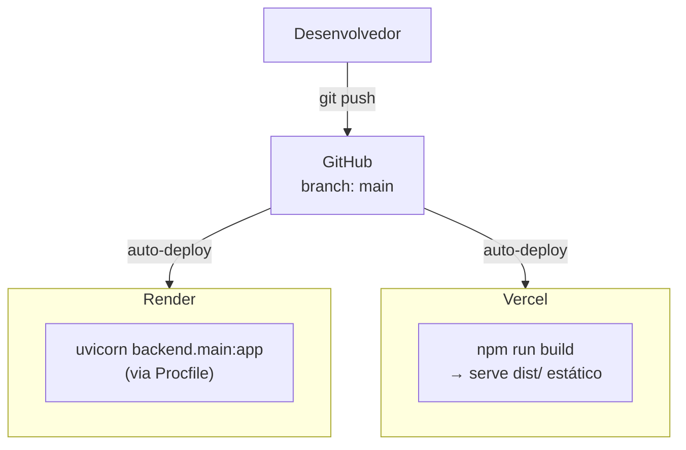
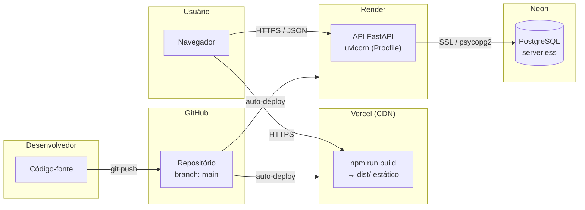

# DevOps

## Infraestrutura de produção

O sistema é composto por três serviços em nuvem, todos integrados ao repositório GitHub:

| Componente | Serviço | Tecnologia |
|---|---|---|
| Frontend | [Vercel](https://vercel.com/) | Build estático gerado pelo Vite (`npm run build`) |
| Backend (API) | [Render](https://render.com/) | Python + FastAPI via Uvicorn |
| Banco de dados | [Neon](https://neon.tech/) | PostgreSQL serverless |

## Processo de implantação

O fluxo de entrega funciona da seguinte forma: qualquer push para a branch `main` do repositório GitHub dispara automaticamente o re-deploy do backend (Render) e do frontend (Vercel), sem necessidade de ação manual.



### Backend — Render

O Render utiliza o `Procfile` presente na raiz do repositório para iniciar a aplicação:

```
web: uvicorn backend.main:app --host 0.0.0.0 --port $PORT
```

As variáveis de ambiente (credenciais do banco, origens CORS permitidas) são configuradas diretamente no painel do Render, sem ficarem expostas no repositório.

### Frontend — Vercel

A Vercel detecta automaticamente que o projeto usa Vite e executa `npm run build` a cada push. O resultado (`dist/`) é distribuído via CDN globalmente.

A variável de ambiente `VITE_API_URL` aponta para a URL da API no Render, configurada no painel da Vercel.

### Banco de dados — Neon

O banco de dados PostgreSQL é hospedado no Neon (PostgreSQL serverless). A string de conexão é fornecida ao backend via variável de ambiente, sem senha exposta no código.

O schema do banco está versionado em [`backend/schema.sql`](backend/schema.sql) e é inicializado automaticamente pelo módulo `backend/init_db.py` na primeira execução.

## Ambiente local

Para desenvolvimento local, o projeto oferece duas opções para o banco de dados:

**Opção 1 — PostgreSQL local (padrão):**
```bash
python install.py   # instala dependências e inicializa o banco local
python run.py       # sobe backend + frontend simultaneamente
```

**Opção 2 — PostgreSQL via Docker Compose:**
```bash
docker-compose up -d   # sobe um container PostgreSQL na porta 5433
python run.py
```

## Diagrama de implantação



---
Veja também: [Home](Home), [Requisitos](Requisitos), [Gestão do Projeto](Gestão-do-Projeto), [Análise e Projeto do Software](Análise-e-Projeto-do-Software), [Testes e Qualidade](Testes-e-Qualidade), [Conclusão](Conclusão).
