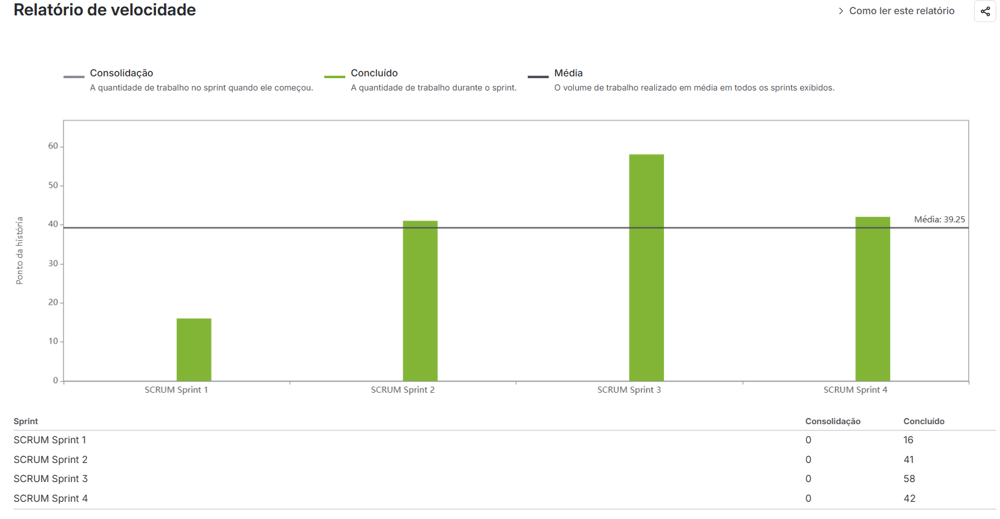
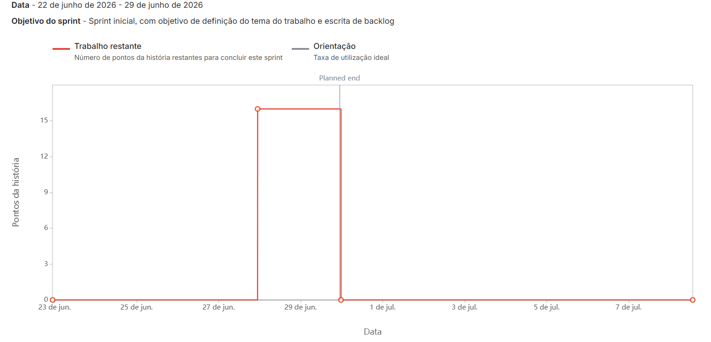
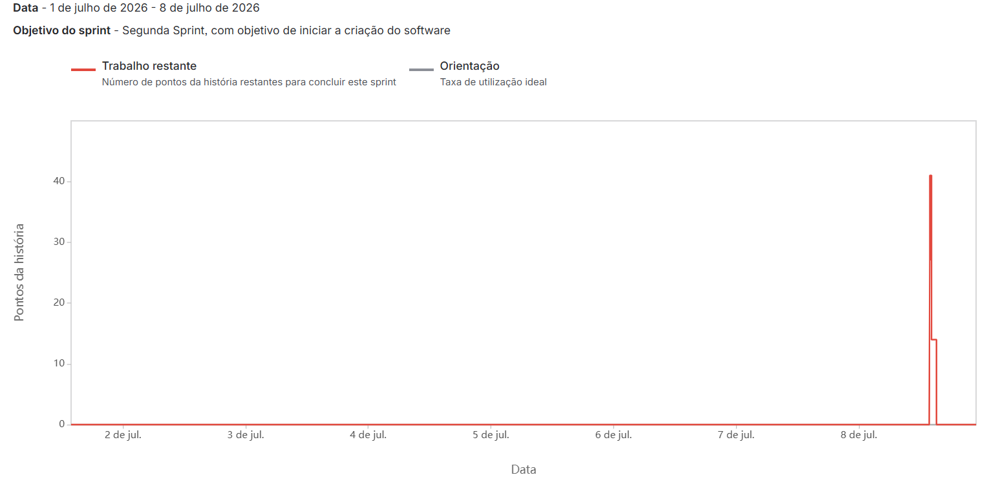
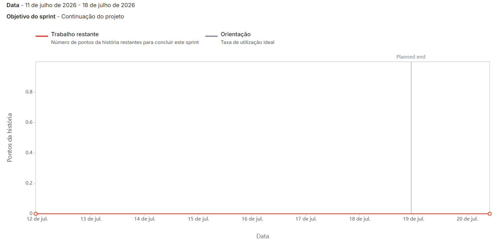
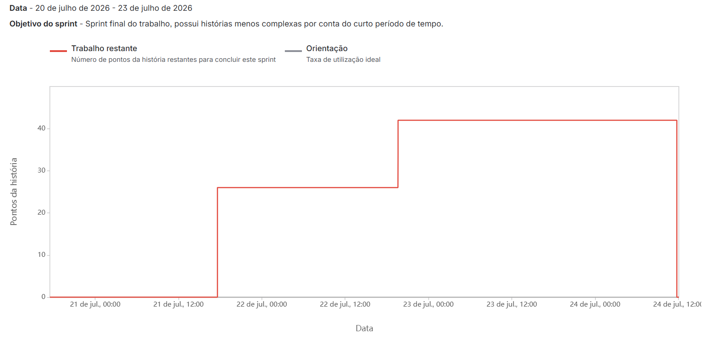

# Gestão do Projeto

## Metodologia

O desenvolvimento seguiu o processo **Scrum**, organizado em 4 sprints e gerenciado no **Jira** (histórias referenciadas por identificadores de ticket, ex.: `SCRUM-9`, `SCRUM-15`, `SCRUM-16/20` em [schema.sql](backend/schema.sql)). Cada sprint teve um objetivo definido explicitamente no Jira:

- **Sprint 1** (22/06/2026 – 29/06/2026, 7 dias): "Sprint inicial, com objetivo de definição do tema do trabalho e escrita de backlog."
- **Sprint 2** (01/07/2026 – 08/07/2026, 7 dias): "Segunda Sprint, com objetivo de iniciar a criação do software."
- **Sprint 3** (11/07/2026 – 18/07/2026, 7 dias): "Continuação do projeto."
- **Sprint 4** (20/07/2026 – 23/07/2026, ~3 dias): "Sprint final do trabalho, possui histórias menos complexas por conta do curto período de tempo."

As sprints tiveram, em geral, duração de uma semana, exceto a última, encurtada propositalmente. Houve intervalos sem sprint ativa entre a Sprint 2 e a 3 (09 a 10/07) e entre a 3 e a 4 (19/07).

As ferramentas de comunicação utilizadas pelo grupo foram **WhatsApp** e **Discord**, tanto para alinhamentos rápidos quanto para sessões de trabalho remoto conjunto (pair programming).

## Papéis da equipe

| Integrante | Papel(is) |
|---|---|
| Mateus | Product Owner |
| Guilherme | Scrum Master |
| Mykaell | Desenvolvedor |
| Flávio | Desenvolvedor |
| Gabriel | Desenvolvedor |

## Números do projeto

- **Total de sprints:** 4 executadas (Sprint 1 a Sprint 4). Uma "Sprint 5" chegou a ser criada no Jira, mas nunca foi iniciada (0 tickets).
- **Data de kick-off:** 22/06/2026 (início da Sprint 1).
- **Data de encerramento:** 23/07/2026 (fim da Sprint 4).
- **Duração das sprints:** Sprint 1, 2 e 3 com 7 dias cada; Sprint 4 reduzida a ~3 dias.
- **Velocidade por sprint** (pontos de história concluídos, via Relatório de Velocidade do Jira):

  | Sprint | Pontos concluídos |
  |---|---|
  | Sprint 1 | 16 |
  | Sprint 2 | 41 |
  | Sprint 3 | 58 |
  | Sprint 4 | 42 |
  | **Média** | **39,25** |

  

- **Gráficos burndown** (Jira → Reports → Burndown Chart):

  
  
  
  

  Os burndowns das sprints 1, 2 e 4 mostram o trabalho concentrado nos últimos dias (pontos entram tarde, geralmente perto do fim do período), em vez de uma queda gradual, o que indica que a estimativa/registro de pontos no Jira aconteceu perto da entrega, não durante a execução. A Sprint 3 aparece zerada no burndown apesar de ter concluído 58 pontos no relatório de velocidade, provavelmente por falta de estimativa de pontos lançada nas histórias durante aquela sprint específica.
  <!-- PLACEHOLDER: confirme com o grupo se esse padrão reflete como vocês de fato trabalhavam (estimativas feitas no fechamento da sprint). Vale mencionar isso na metodologia se for o caso. -->

- **Cerimônias realizadas:**
  - **Sprint Planning:** realizada em poucas sprints, de forma remota via Discord. O grupo definia quais histórias do backlog seriam desenvolvidas e as tarefas associadas a cada uma.
  - **Daily Scrum:** não foi adotada formalmente. O acompanhamento do progresso acontecia de forma assíncrona pelo grupo do WhatsApp, onde cada membro compartilhava o que havia feito e o que estava planejando. Quando necessário, o grupo realizava sessões de pair programming via Discord.
  - **Sprint Review / Retrospectiva:** não foram realizadas formalmente. Ao fim de cada sprint, o grupo alinhava pelo WhatsApp o que havia sido desenvolvido e coordenava a gravação e envio do vídeo de entrega no Teams.

## Transbordos de tarefas

A investigação no Jira esclareceu o caso da história *"Como administrador, quero bloquear usuários temporariamente para evitar uso indevido"* (`SCRUM-9`): ela está parada no **Backlog geral**, sem sprint associada, com status **"A Fazer"**. Ou seja, do ponto de vista do Scrum/Jira ela **nunca foi planejada para nenhuma sprint**, embora o código do sistema já a implemente por completo (colunas de bloqueio no schema, endpoints de bloquear/desbloquear, checagem no login e UI em `UsersScreen.jsx`).

Isso não é um transbordo típico (história que estoura o prazo de uma sprint e é concluída na seguinte); é mais provável que a equipe tenha implementado a funcionalidade informalmente, fora do fluxo rastreado no Jira, sem nunca mover o card.

<!-- PLACEHOLDER: confirme com o grupo quando/por que essa história foi implementada fora do Jira, e se houve outros casos de transbordo real (história que passou de uma sprint para a seguinte). -->

## Backlog inicial x Backlog final

**Backlog inicial (planejado):**

O backlog inicial foi construído durante a Sprint 1 (22/06 a 29/06/2026), com foco em identificar as principais necessidades do sistema a partir do domínio de gestão de estoque de supermercado. As histórias foram escritas e organizadas no Jira antes do início da Sprint 2, cobrindo os três perfis de usuário definidos (Administrador, Estoque e Caixa) e suas respectivas responsabilidades no sistema.

**Backlog final (executado):**

Das histórias efetivamente trabalhadas ao longo das 4 sprints, **todas as 12 histórias funcionais listadas em [Requisitos](Requisitos) foram entregues**. A única história que permanece formalmente pendente no Jira é:

- Como administrador, quero bloquear usuários temporariamente para evitar uso indevido. `SCRUM-9`, status "A Fazer", sem sprint. *(tecnicamente implementada no código, mas nunca movida no Jira; ver [Requisitos](Requisitos) e a seção de transbordos acima)*

De forma geral, o que foi planejado no backlog inicial foi executado ao longo das quatro sprints. A única história que permanece formalmente pendente no Jira é o bloqueio de usuários (`SCRUM-9`), que — como descrito na seção de transbordos — foi implementada no código fora do fluxo rastreado.

---
Veja também: [Home](Home), [Requisitos](Requisitos), [Análise e Projeto do Software](Análise-e-Projeto-do-Software), [Testes e Qualidade](Testes-e-Qualidade), [DevOps](DevOps), [Conclusão](Conclusão).
