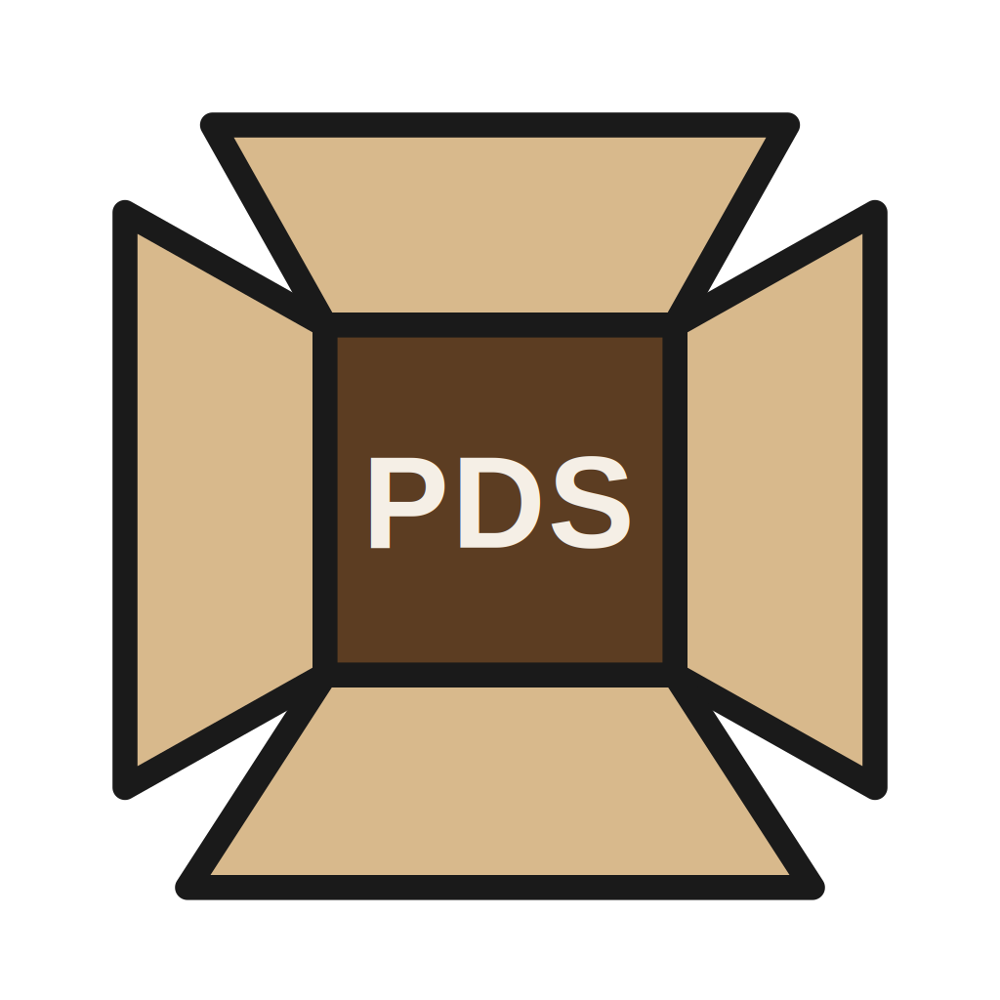
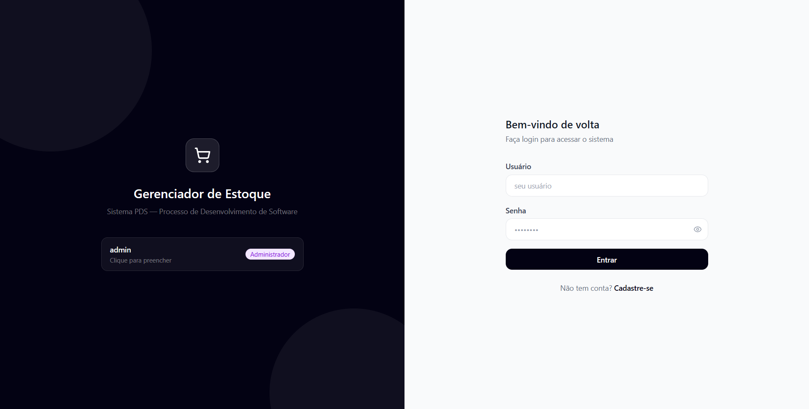
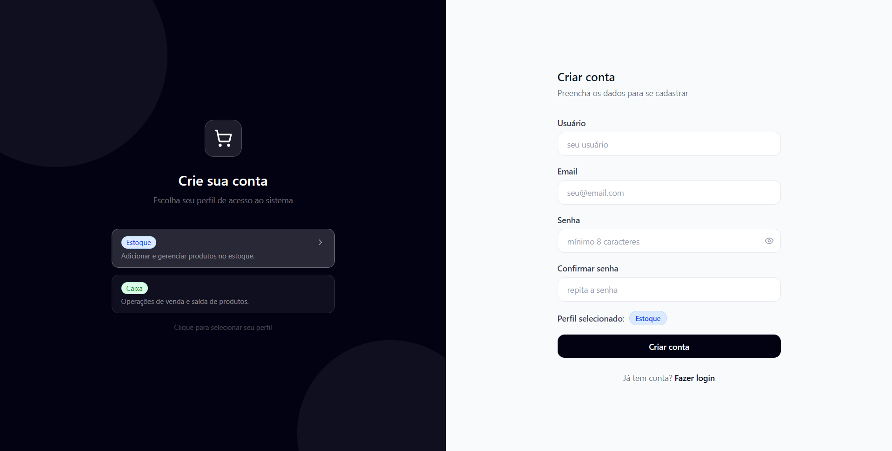
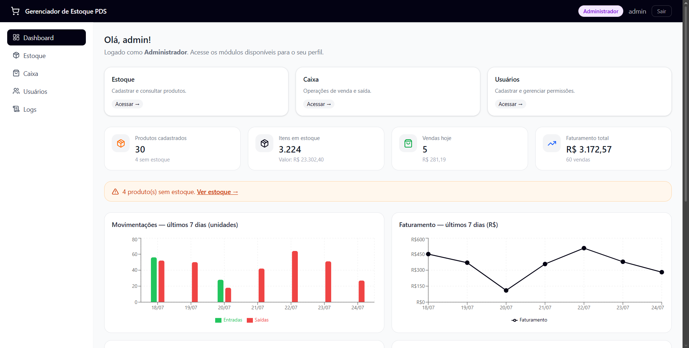
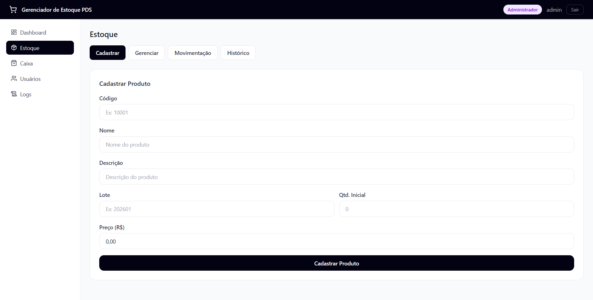
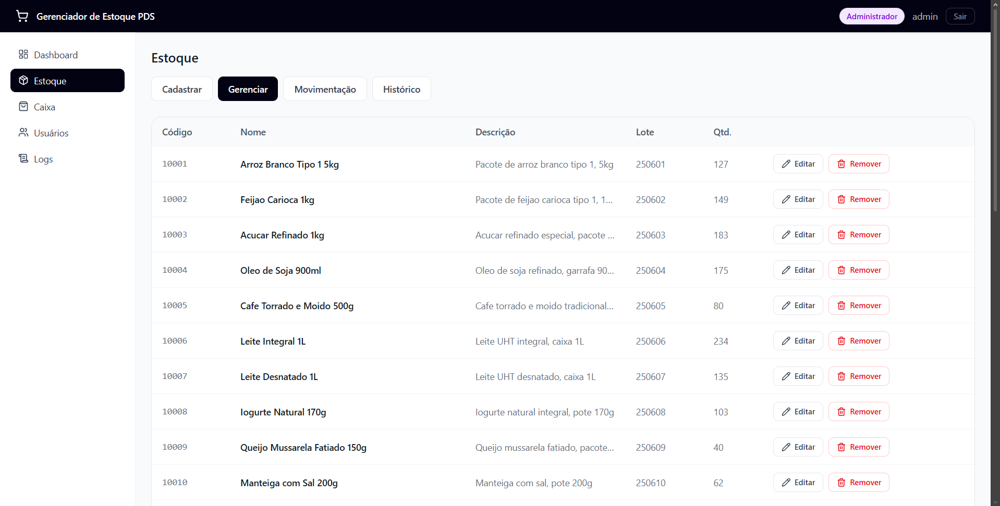
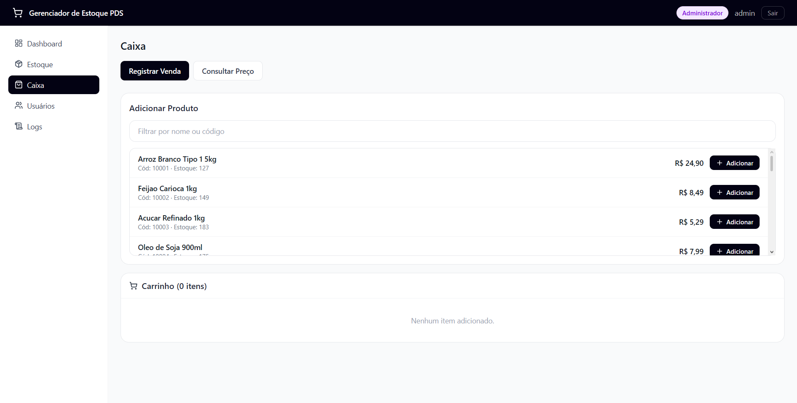
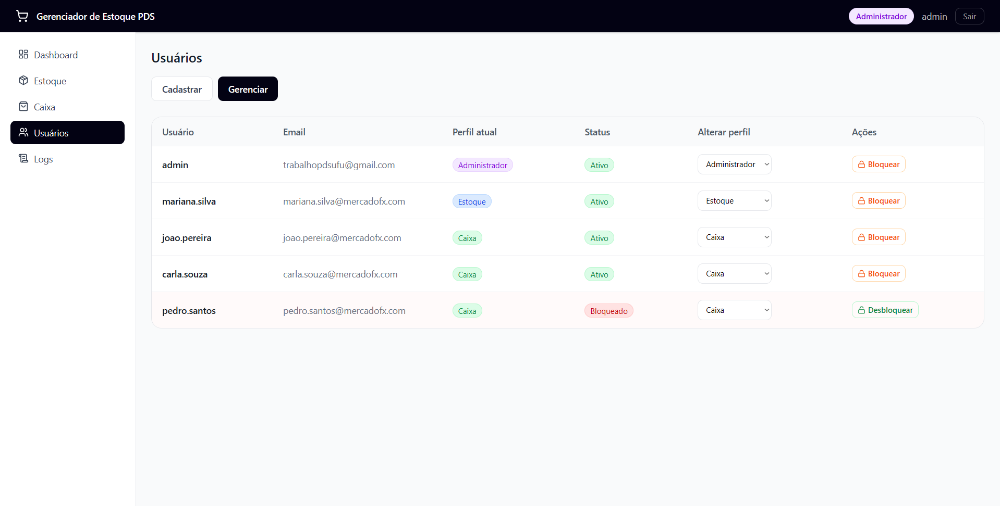
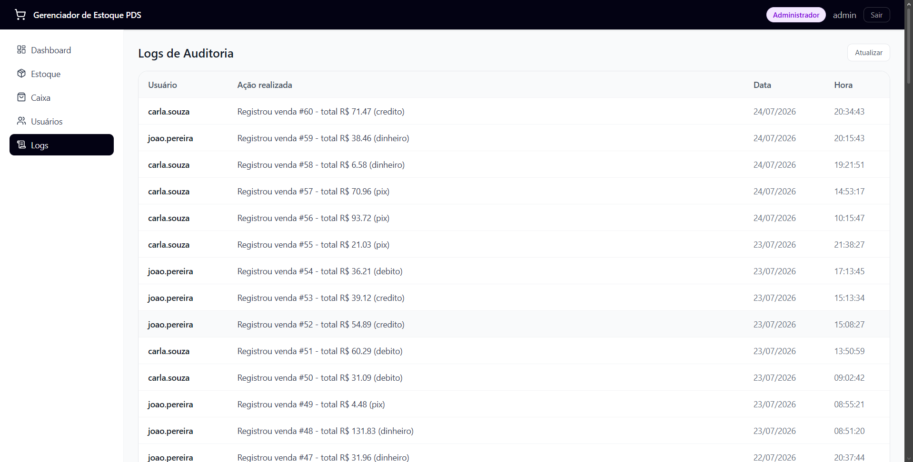

# Gerenciador de Estoque PDS

## O que é o sistema

O **Gerenciador de Estoque PDS** é um sistema web de gestão de estoque e ponto de venda voltado para supermercados. Ele permite:

- Cadastrar, editar, consultar e remover produtos (código, nome, descrição, lote, quantidade e preço);
- Registrar entradas e saídas de estoque, com histórico completo de movimentações (quantidade, usuário responsável e estoque antes/depois de cada operação);
- Registrar vendas no caixa, com carrinho de itens, desconto, múltiplas formas de pagamento (dinheiro, crédito, débito, PIX), cancelamento antes da finalização e emissão de comprovante;
- Gerenciar usuários e permissões por perfil: **Administrador**, **Estoque** e **Caixa**, cada um com acesso a telas e ações específicas;
- Bloquear/desbloquear usuários temporariamente, com motivo e data de desbloqueio opcional;
- Auditar o uso do sistema através de um log de ações (quem fez o quê e quando);
- Visualizar um dashboard com indicadores (produtos em estoque, valor em estoque, produtos sem estoque, vendas e faturamento do dia/total, produtos com baixo estoque, produtos mais movimentados) e gráficos de vendas e movimentações dos últimos dias.

O sistema é composto por um frontend em React (Vite + Tailwind CSS) e uma API backend em Python (FastAPI), com persistência em PostgreSQL.

## Motivação

- A motivação de desenvolver este software é que, usualmente, os serviços de gerenciamento de estoque disponíveis no mercado são algo feito de modo dedicado e que gera alto custo de manutenção e adaptabilidade para cada cenário. A ideia de desenvolver um software Open Source para esta finalidade, é concentrar as demandas comuns que estes softwares de gerenciamento têm, e agregar neles à medida que os usuários apresentam suas necessidades reduzindo assim o custo dos proprietários de contratar toda uma infraestrutura para desenvolver um sistema dedicado. 
- A expertise dos membros lidando com estas tecnologias em projetos anteriores motivou a escolha de ferramentas como FastAPI, React e Python. Além disso, a escolha do tema teve pouca influência de experiências externas do grupo visto que a prática individual é de sistemas diversos que seriam um tanto mais complexos e inviáveis de implementar na duração e demanda real do trabalho.

## Telas do sistema

**Login**

**Cadastro de conta**

**Dashboard** (visão do Administrador)

**Estoque: cadastro de produto**

**Estoque: lista de produtos**

**Caixa: registrar venda**

**Usuários: gestão de perfis e bloqueio**

**Logs de auditoria**

<!-- PLACEHOLDER: falta o print do Comprovante de venda gerado no Caixa (CashierScreen.jsx), opcional, mas complementa bem esta seção. -->

## Perfis de acesso

| Perfil | Telas acessíveis |
|---|---|
| Administrador | Dashboard, Estoque, Caixa, Usuários, Logs |
| Estoque | Dashboard, Estoque |
| Caixa | Dashboard, Caixa |

---

## DATAS DA SPRINT:

- 30/06 - Planning Sprint 2
Uma reunião de 1 hora com o PO para definir as histórias que definiam a base do projeto, ademais, definir e pontuar as substask que seriam desenvolvidas, sempre visando esclarecer claramente.

- 09/07 - Review Sprint 2
Apresentação das funcionalidades através  da execução do programa para o PO, usando validações definidas na Planning para confirmar o desenvolvimento correto da funcionalidade

- 10/07 - Planning Sprint 3

- 19/07 - Review Sprint 3

- 20/07 - Planning Sprint 4

Dailys
Realizadas diariamente através de troca de mensagens via veículo de comunicação escolhido pela equipe. 

## Info's sobre a hospedagem

- Último ponto da gestão do projeto:
- Banco: Postgres no Neon
- Back: Render
- Front: Vercel

## BACKLOG INICIAL DO PROJETO

- Ajustes Iniciais do Projeto
- Como administrador, quero cadastrar novos usuários no sistema para controlar quem tem acesso à aplicação.
- Como usuário de estoque, quero cadastrar novos produtos para adicioná-los ao sistema.
- Como administrador, quero definir níveis de permissão (estoque, caixa, administrador) para garantir segurança no sistema.
- Como administrador, quero visualizar logs de ações dos usuários para auditar o uso do sistema.
- Como administrador, quero bloquear usuários temporariamente para evitar uso indevido.
- Como usuário de estoque, quero editar informações de produtos para manter os dados atualizados.
- Como usuário de estoque, quero remover produtos que não são mais comercializados.
- Como usuário de estoque, quero registrar saída e entrada de produtos para manter o controle correto.
- Como usuário de estoque, quero consultar o histórico de movimentações para análise.
- Como usuário caixa, quero registrar vendas de produtos para efetuar compras no sistema.
- Como usuário caixa, quero visualizar o total da compra.
- Como usuário caixa, quero cancelar uma venda antes da finalização para corrigir erros.
- Como usuário caixa, quero emitir comprovante de venda para entregar ao cliente.
- Como usuário caixa, quero consultar o preço de um produto para informar o cliente.

---

Veja também: [Requisitos](Requisitos), [Gestão do Projeto](Gestão-do-Projeto), [Análise e Projeto do Software](Análise-e-Projeto-do-Software).
