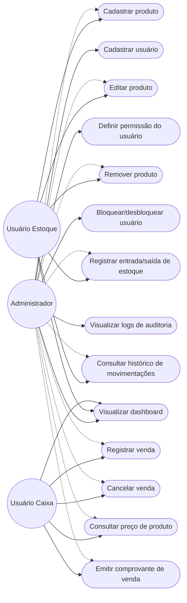

# Requisitos

## Diagrama de Casos de Uso

Visão geral de quem pode fazer o quê, derivada das regras de RBAC do backend (`requer_role`) e do menu por perfil (`constants/roles.js`). O perfil **Administrador** herda, na prática, o acesso das telas de Estoque e Caixa (setas tracejadas) além das suas ações exclusivas de gestão de usuários e auditoria.

## Histórias do projeto

As histórias abaixo estão organizadas por sprint, conforme o backlog do projeto (Jira). O status de entrega foi cruzado com o código-fonte atual do repositório.

### Sprint 1: Ajustes Iniciais do Projeto

Configuração inicial do repositório, estrutura de pastas (frontend/backend), scripts de instalação/execução e definição do escopo do sistema.

**Status:** ✅ Entregue

### Sprint 2

| História | Status |
|---|---|
| Como administrador, quero cadastrar novos usuários no sistema para controlar quem tem acesso à aplicação. | ✅ Entregue: `POST /cadastrar` (admin) em [auth.py](backend/rotas/auth.py) |
| Como usuário de estoque, quero cadastrar novos produtos e adicioná-los ao sistema. | ✅ Entregue: `POST /cadastrarProduto` em [produtos.py](backend/rotas/produtos.py) |

### Sprint 3

| História | Status |
|---|---|
| Como usuário de estoque, quero registrar saída e entrada de produtos para manter o controle correto. | ✅ Entregue: `POST /movimentacoes` em [movimentacoes.py](backend/rotas/movimentacoes.py) |
| Como usuário de estoque, quero remover produtos que não são mais comercializados. | ✅ Entregue: `DELETE /produtos/{cod}` |
| Como administrador, quero definir níveis de permissão (estoque, caixa, administrador) para garantir segurança no sistema. | ✅ Entregue: `PUT /usuarios/{id}/role`, RBAC via [dependencias.py](backend/dependencias.py) |
| Como administrador, quero visualizar logs de ação dos usuários para auditar o uso do sistema. | ✅ Entregue: `GET /logs` em [logs.py](backend/rotas/logs.py), tela [LogsScreen.jsx](frontend/src/screens/logs/LogsScreen.jsx) |
| Como usuário, quero editar informações de produtos para manter os dados atualizados. | ✅ Entregue: `PUT /produtos/{cod}` |

### Sprint 4

| História | Status |
|---|---|
| Como usuário caixa, quero registrar vendas de produtos para efetuar compras no sistema. | ✅ Entregue: `POST /vendas` em [vendas.py](backend/rotas/vendas.py) |
| Como usuário caixa, quero visualizar o total da compra. | ✅ Entregue: cálculo de subtotal/desconto/total em tempo real no [CashierScreen.jsx](frontend/src/screens/cashier/CashierScreen.jsx) |
| Como usuário caixa, quero cancelar uma venda antes da finalização para corrigir erros. | ✅ Entregue: ação "Cancelar venda" no CashierScreen.jsx |
| Como usuário caixa, quero consultar o preço de um produto para informar o cliente. | ✅ Entregue: busca de produto (`GET /produtos/buscar`) exibida no carrinho |
| Como usuário de estoque, quero consultar o histórico de movimentações para análise. | ✅ Entregue: `GET /movimentacoes` (com filtros e paginação) |
| Como usuário caixa, quero emitir comprovante de venda para entregar ao cliente. | ✅ Entregue: componente `Comprovante` no CashierScreen.jsx |

### Backlog não entregue

| História | Status |
|---|---|
| Como administrador, quero bloquear usuários temporariamente para evitar uso indevido. | ❌ **Não entregue.** O card `SCRUM-9` permanece no Backlog geral, sem sprint associada, com status "A Fazer" no Jira. O sistema já conta com essa funcionalidade implementada (colunas `bloqueado`, `motivo_bloqueio` e `data_desbloqueio` no `schema.sql`; endpoints `PUT /usuarios/{id}/bloquear` e `/desbloquear`; validação no login; interface completa em `UsersScreen.jsx`), desenvolvida fora do fluxo formal de sprints. Ver discussão em [Gestão do Projeto](Gestão-do-Projeto#transbordos-de-tarefas). |

## Requisitos não-funcionais

<!-- PLACEHOLDER: revise e complemente esta lista. Os itens abaixo foram inferidos do código-fonte; adicione requisitos de desempenho, disponibilidade, usabilidade, etc. que o grupo tenha definido formalmente. -->

- **Segurança de credenciais:** senhas de usuário devem ser armazenadas com hash (bcrypt), nunca em texto puro (`dependencias.py`).
- **Controle de acesso baseado em papéis (RBAC):** cada endpoint da API deve restringir o acesso conforme o perfil do usuário (admin, estoque, caixa) (`requer_role` em `dependencias.py`).
- **Auditabilidade:** toda operação de escrita relevante (cadastro/edição/remoção de produto, movimentação de estoque, venda, bloqueio de usuário, etc.) deve gerar um registro de log de auditoria.
- **Validação de dados de entrada:** regras mínimas de formato são aplicadas no backend (ex.: usuário com no mínimo 3 caracteres, senha com no mínimo 8 caracteres, e-mail com formato válido, código de produto com no mínimo 5 dígitos, lote com no mínimo 6 dígitos).
- **Consistência transacional:** operações que afetam múltiplas tabelas (ex.: registrar venda: baixa de estoque + movimentação + item de venda) devem ser atômicas, com rollback em caso de erro.
- **Portabilidade/Configuração:** URL da API e origens permitidas de CORS devem ser configuráveis via variáveis de ambiente (`.env`), não fixas no código.
- **Usabilidade/Responsividade:** a interface deve se adaptar a telas menores (existe um componente de menu para dispositivos móveis, `MobileDrawer.jsx`).
- **Persistência:** os dados devem ser armazenados em um banco de dados relacional (PostgreSQL).
- <!-- PLACEHOLDER: requisito de desempenho (ex: tempo de resposta esperado da API) -->
- **Disponibilidade/Hospedagem:** o sistema roda em serviços gerenciados na nuvem — frontend na Vercel, API na Render e banco PostgreSQL no Neon (ver [Implantação](Análise-e-Projeto-do-Software#implantação)) — sem depender de infraestrutura própria.
- <!-- PLACEHOLDER: requisitos de compatibilidade de navegador/dispositivo -->

---
Veja também: [Home](Home), [Gestão do Projeto](Gestão-do-Projeto), [Análise e Projeto do Software](Análise-e-Projeto-do-Software).
